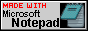
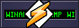

_<h2 align="center"> bonjour, je m'apelle dimitry ✌️</h2>_

__
Sou estudante de ciência da computação na Universidade federal do Espírito Santo. Gosto de gatos, paz, música e tecnologia.
__

    

<!--
**shoui000/shoui000** is a ✨ _special_ ✨ repository because its `README.md` (this file) appears on your GitHub profile.

Here are some ideas to get you started:

- 🔭 I’m currently working on ...
- 🌱 I’m currently learning ...
- 👯 I’m looking to collaborate on ...
- 🤔 I’m looking for help with ...
- 💬 Ask me about ...
- 📫 How to reach me: ...
- 😄 Pronouns: ...
- ⚡ Fun fact: ...
-->
